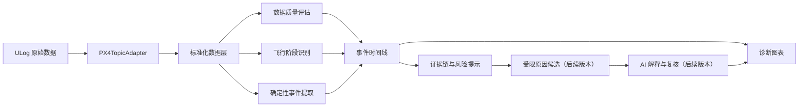

# 飞控日志事故与异常飞行分析重构方案

## 1. 背景

当前项目已经具备以下基础能力：

- 上传并解析 PX4 `.ulg` 日志
- 展示常见 topic 图表
- 计算部分控制回路质量指标
- 根据简单规则输出诊断提示
- 使用 AI 对结构化结果进行辅助审查

下一阶段希望将“功能一”重构为事故与异常飞行分析入口，协助用户定位异常发生时间、查看相关证据，并逐步识别炸机、失控和异常飞行的可能原因。

本功能不应被设计为“将整份日志交给 AI 猜测原因”。推荐采用以下原则：

> 程序负责提取证据，检测器负责识别异常现象，因果引擎负责组织候选关系，AI 负责解释证据并生成受约束的分析报告。

事故分析的重点不是给出唯一答案，而是提供可追溯、可验证、明确表达不确定性的证据链。

第一阶段不自动判定炸机根因，产品定位为：

> 建立可信的飞行事件时间线、数据质量判断和可追溯证据跳转。

完整原因推理、AI 报告、历史基线和开放式异常发现属于后续版本，不能作为第一版的交付前提。

## 2. 功能目标

系统的长期目标是依次回答以下问题：

1. 日志是否真实、完整且足以分析？
2. 本次飞行经历了哪些阶段和关键事件？
3. 最早的异常发生在什么时间？
4. 异常如何传播并最终导致失控、坠落或任务失败？
5. 哪些原因最符合当前证据？
6. 存在哪些反证、替代解释和数据限制？

第一版只回答：

1. 日志是否真实、完整且足以做基础分析？
2. 本次飞行经历了哪些粗粒度阶段？
3. 日志中有哪些明确记录的关键事件？
4. 是否存在需要关注的疑似风险事件，例如日志在疑似空中状态下结束？
5. 每个事件对应的原始证据和图表位置在哪里？

“核心异常现象”和“最早异常时间”从 V2 开始实现，V1 不承诺异常诊断结论。

系统输出应区分：

- 已确认事件：日志明确记录的状态或事件
- 高度疑似原因：由多个独立证据共同支持
- 可能的促成因素：可能放大事故影响，但不是首发异常
- 后果：由前序异常导致的现象
- 无法确定：现有日志不足以区分的物理原因

## 3. 非目标与安全边界

第一阶段不包含以下能力：

- 自动向飞控写入参数
- 自动控制飞行器
- 仅凭相关性断言硬件已经损坏
- 在解析失败时使用模拟数据生成事故结论
- 将 AI 输出作为唯一诊断依据
- 保证覆盖所有现实中的炸机原因
- 完整事故根因推理
- 原因候选概率或自动硬件故障判定
- 历史正常日志基线
- 开放式异常发现和频谱突变分析
- AI 自然语言报告

系统必须使用审慎措辞。例如，缺少 ESC 转速、电流和温度数据时，只能报告“某动力单元出现推力不足特征”，不能直接断言“某个 ESC 损坏”。

## 4. 总体架构



建议将数据模型拆分为三层：

```text
RawLogModel       原始解析数据，尽量保留 ULog 语义
AnalysisModel    标准化信号、事件、证据和因果候选
ChartViewModel   面向前端图表展示的数据
```

诊断逻辑不得依赖为图表展示而裁剪、重命名或降采样后的数据。

### 4.1 PX4TopicAdapter

`PX4TopicAdapter` 是独立的高风险基础模块，负责将不同 PX4 版本中的 topic、字段和 instance 映射为统一标准信号。

```text
PX4 原始 topic
-> 版本与字段兼容
-> 多 instance 识别
-> 单位和坐标约定转换
-> 标准信号
-> 数据质量与检测器
```

它需要集中处理：

- 不同 PX4 版本中的 topic 名称变化
- 同一 topic 的字段变化
- `actuator_outputs`、`actuator_motors`、`actuator_controls` 差异
- `vehicle_status`、`vehicle_land_detected`、`estimator_status` 差异
- topic 未记录或字段部分缺失
- 多 instance topic 的来源与选择
- 单位、符号和坐标系差异

检测器只能依赖标准信号，例如：

```text
attitude.roll
attitudeSetpoint.roll
angularRate.roll
angularRateSetpoint.roll
actuator.output[0]
battery.voltage
estimator.positionHealthy
```

V1 最小标准信号表：

| 类别 | 标准信号 | V1 要求 | 说明 |
| --- | --- | --- | --- |
| 时间 | `log.timeS` | 必须 | 所有事件和图表联动使用同一日志时间轴 |
| 解锁 | `vehicle.armed` | 必须 | 用于判断是否发生有效飞行和空中结束风险 |
| 降落状态 | `vehicle.landed` | 必须 | 可由 `vehicle_land_detected` 或等价状态映射 |
| 模式 | `vehicle.navState` | 必须 | 用于模式切换时间线 |
| failsafe | `vehicle.failsafe` | 必须 | 优先来自 PX4 明确状态或事件 |
| 日志事件 | `px4.events` / `px4.messages` | 建议 | 能解析则进入确定性事件时间线 |
| 高度 | `position.altitudeRelative` | 建议 | 用于辅助起飞、落地和疑似空中结束判断 |
| 电池 | `battery.voltage` | 建议 | V1 仅展示数据可用性，不做电池异常结论 |
| EKF | `estimator.flags` | 建议 | V1 仅提取明确 flag/reset 事件 |
| 姿态 | `attitude.roll/pitch/yaw` | 后续 | V2 控制异常检测使用 |
| 角速度 | `angularRate.roll/pitch/yaw` | 后续 | V2 控制异常检测使用 |
| 执行器 | `actuator.output[]` | 后续 | V2 前需补 actuator role 映射 |

V1 中“必须”信号缺失时，不进入完整事件时间线；“建议”信号缺失时，允许降级展示，并写入 `missingSignals`。

V1 标准信号来源映射：

| 标准信号 | 首选来源 | 备选来源 | 缺失处理 |
| --- | --- | --- | --- |
| `log.timeS` | 各 topic `timestamp` 统一换算 | ULog header 起始时间辅助 | 无有效时间轴则 `invalid` |
| `vehicle.armed` | `vehicle_status.arming_state` | `actuator_armed.armed`、PX4 event/message | 缺失则 `insufficient` |
| `vehicle.landed` | `vehicle_land_detected.landed` | `vehicle_status` landed 相关字段、保守运动状态推断 | 缺失则降级，起降事件标为推断 |
| `vehicle.navState` | `vehicle_status.nav_state` | PX4 event/message | 缺失则 `partial`，不展示模式时间线 |
| `vehicle.failsafe` | `vehicle_status` failsafe 相关字段 | PX4 event/message | 缺失写入 `missingSignals` |
| `px4.events/messages` | PX4 event/log message topic | 无 | 缺失写入 `missingSignals` |
| `position.altitudeRelative` | `vehicle_local_position.z` 派生相对高度 | `vehicle_global_position.alt` 辅助派生 | 缺失则不做起降辅助推断 |
| `battery.voltage` | `battery_status.voltage_v` | 无 | 缺失写入 `missingSignals` |
| `estimator.flags` | `estimator_status` / `estimator_status_flags` | PX4 event/message | 缺失写入 `missingSignals` |

检测器内部不得重复编写 PX4 topic 兼容逻辑。

## 5. 上传解析后的默认页面

V1 页面名称建议使用保守表达，例如：

- 飞行日志概览
- 飞行事件分析
- 日志事件时间线
- 异常飞行初步分析

到 V3/V4 具备异常传播链和受限原因候选后，再升级为“事故分析”。上传成功后不应默认展示大量原始 topic 图。V1 默认页面应优先回答“能否分析、飞行经过了什么、有哪些确定事件、点哪里看证据”。

### 5.1 数据完整性

页面顶部展示：

- ULog 是否成功解析
- 数据来源是否为真实日志
- 固件版本和飞行器类型
- 日志总时长和实际解锁飞行时长
- 解锁次数
- 是否疑似异常终止
- 关键 topic 和字段缺失情况
- 时间轴是否连续
- 数据质量等级

建议的数据质量等级：

- `complete`：关键数据完整，可以进行完整分析
- `partial`：部分数据缺失，只能进行降级分析
- `insufficient`：证据不足，不输出事故原因
- `invalid`：文件无效或解析失败

数据质量判定规则：

| 等级 | 判定条件 |
| --- | --- |
| `invalid` | 文件无法解析、非 ULog、无有效日志时间轴、解析器输出结构无效 |
| `insufficient` | 缺少 `vehicle_status` 或等价状态；缺少解锁状态；无法判断基础飞行阶段；日志时长过短；必须信号大面积缺失 |
| `partial` | 能识别基础飞行阶段和确定性事件，但缺少部分建议或后续分析信号，例如 actuator、battery、estimator、events |
| `complete` | 基础飞行阶段、状态、模式、failsafe、姿态、执行器、电池和估计器等核心数据基本完整 |

V1 只要求达到 `partial` 以上即可生成基础时间线。只有达到更高数据质量，并且对应信号齐全时，后续版本才允许输出更强的异常或原因结论。

数据质量规则应可计算化：

```ts
type DataQualityRule = {
  code: string
  level: 'invalid' | 'insufficient' | 'partial' | 'complete'
  condition: string
  message: string
}
```

V1 最小规则集：

| code | level | condition | message |
| --- | --- | --- | --- |
| `DQ_MISSING_TIME_AXIS` | `invalid` | 无有效 `log.timeS` | 日志缺少可用时间轴 |
| `DQ_PARSE_FAILED` | `invalid` | ULog 解析失败或输出结构无效 | 日志解析失败 |
| `DQ_MISSING_ARM_STATE` | `insufficient` | 缺少 `vehicle.armed` | 无法判断解锁状态 |
| `DQ_MISSING_LANDED_STATE` | `insufficient` | 缺少 `vehicle.landed` 且无法保守推断 | 无法判断基础飞行阶段 |
| `DQ_SHORT_LOG` | `insufficient` | 有效日志时长低于保守阈值，例如 5 秒 | 日志时长过短 |
| `DQ_MISSING_NAV_STATE` | `partial` | 缺少 `vehicle.navState` | 无法展示模式时间线 |
| `DQ_MISSING_OPTIONAL_BATTERY` | `partial` | 缺少 `battery.voltage` | 电池数据不可用 |
| `DQ_MISSING_OPTIONAL_ESTIMATOR` | `partial` | 缺少 `estimator.flags` | 估计器状态不可用 |

事故诊断链路必须遵守：

```text
真实解析成功 -> 可以分析
部分解析成功 -> 降级分析，并明确缺失证据
解析失败     -> 拒绝输出事故原因
```

### 5.2 飞行摘要

默认展示：

- 起飞和降落时间
- 飞行模式及其时间区间
- 最大相对高度
- 最大水平速度和垂直速度
- 最低电压和最大电流
- GPS 与估计器状态摘要
- failsafe 和异常模式切换次数
- 日志结束时状态：正常落地、空中终止或无法判断

### 5.3 事件时间线

事件时间线应作为主视图。例如：

```text
00:12  解锁
00:18  起飞
01:42  GPS 精度下降
01:44  EKF 位置创新异常
01:45  飞行模式发生变化
02:11  某动力输出持续接近上限
02:12  Roll rate 跟踪失效
02:13  姿态快速偏离
02:14  高度快速下降
02:15  检测到撞击特征，日志结束
```

点击事件后，所有相关图表应定位到对应时间窗口。

### 5.4 V1 默认摘要

V1 不展示“主要异常现象”或“最早异常时间”，因为 V1 尚未实现数值型异常检测。默认展示：

- 数据质量摘要
- 当前可分析能力
- 飞行过程摘要
- 确定性事件摘要
- 疑似风险提示
- 缺失数据提示
- 数据限制
- 下一步建议查看的图表

V2 后再增加：

- 异常现象摘要
- 最早异常时间
- 当前证据支持等级
- 支持证据

后续版本可以增加反证、替代解释和受限原因候选，但不得将异常现象直接等同于具体硬件根因。

对用户展示时使用离散证据等级：

- 明确记录
- 证据支持较强
- 存在相关特征
- 证据不足
- 无法判断

内部数值分数只用于排序和调试，默认不得显示为“故障概率”。

### 5.5 默认诊断图表

建议默认只显示以下诊断图组：

1. 解锁状态、飞行模式和 failsafe
2. 姿态设定值与实际值
3. 角速度设定值与实际值
4. 执行器输出、控制分配和饱和状态
5. 高度、垂直速度和加速度
6. 电池、GPS、估计器、振动和传感器状态

完整原始 topic 图放在“高级数据”页面。

## 6. 标准化数据层

当前面向图表的 `topicCharts` 不适合作为事故诊断数据源。标准化层需要：

- 使用日志级统一时间基准
- 保留原始 topic、instance 和字段来源
- 保留采样率与时间缺口信息
- 统一常用物理量和单位
- 记录字段转换和派生过程
- 将原始信号与派生信号明确区分
- 保留飞控参数、固件版本和机型信息

建议的核心模型：

```ts
type NormalizedSignal = {
  id: string
  topic: string
  instance: number
  field: string
  unit: string
  source: 'raw' | 'derived'
  points: Array<[timeS: number, value: number]>
  sampleRateHz: number | null
  missingRatio: number
}

type NormalizedFlightLog = {
  logId: string
  fileName: string
  firmware: Record<string, string | number | null>
  vehicle: Record<string, string | number | null>
  parameters: Record<string, number | string>
  timeRange: {
    startS: number
    endS: number
  }
  signals: Record<string, NormalizedSignal>
  rawEvents: RawFlightEvent[]
  dataQuality: DataQualityReport
}
```

所有 topic 应使用相同的日志时间基准，不能分别从自己的第一条数据开始计时。

### 6.1 分析能力与映射报告

`dataQuality` 只说明日志整体质量，不能完整表达“当前能做哪些分析”。因此 V1 需要同时返回 `analysisCapability`。

两者职责不同：

- `dataQuality`：这份日志本身质量如何。
- `analysisCapability`：基于当前数据，系统能做哪些分析、不能做哪些分析。

后端功能开关应优先看 `analysisCapability`，而不是只看 `dataQuality.level`。例如缺少电池数据时，日志可能是 `partial`，但仍可做时间线；缺少执行器时不能做 actuator 分析；缺少 landed 状态时不能可靠做阶段识别。

```ts
type AnalysisCapability = {
  timeline: boolean
  phaseDetection: boolean
  eventExtraction: boolean
  attitudeAnalysis: boolean
  rateAnalysis: boolean
  actuatorAnalysis: boolean
  batteryAnalysis: boolean
  estimatorAnalysis: boolean
  reasons: string[]
}
```

示例：

```json
{
  "dataQuality": { "level": "partial" },
  "analysisCapability": {
    "timeline": true,
    "phaseDetection": true,
    "eventExtraction": true,
    "attitudeAnalysis": false,
    "rateAnalysis": false,
    "actuatorAnalysis": false,
    "batteryAnalysis": true,
    "estimatorAnalysis": false,
    "reasons": ["actuator.output[] missing", "estimator.flags missing"]
  }
}
```

`PX4TopicAdapter` 还应输出映射报告，便于排查某个日志是数据缺失、映射失败还是检测器问题。

```ts
type SignalMappingReport = {
  standardSignal: string
  status: 'mapped' | 'missing' | 'derived' | 'ambiguous'
  sourceTopic?: string
  sourceInstance?: number
  sourceField?: string
  unit?: string
  warning?: string
}
```

### 6.2 证据链接

V1.3 的图表跳转依赖 `EvidenceLink`。

```ts
type EvidenceLink = {
  signalId: string
  chartGroupId: string
  startTimeS: number
  endTimeS: number
  sourceTopic?: string
  sourceInstance?: number
  sourceField?: string
  note?: string
}
```

## 7. 飞行阶段识别

异常判断必须结合飞行阶段。V1 只识别五个粗粒度阶段：

- `disarmed`：未解锁
- `armed_not_airborne`：已解锁但未起飞
- `airborne`：空中飞行
- `landing_or_landed`：降落或触地
- `unknown_or_end`：日志结束或状态未知

V2 以后再细分：

- 上电初始化
- 起飞
- 爬升
- 悬停或稳定飞行
- 手动机动
- 任务飞行
- 返航
- 失控或快速坠落
- 撞击后

阶段识别优先使用明确状态：

- 解锁状态
- landed 状态
- nav state
- failsafe 状态
- setpoint 和实际运动状态

V1 不追求精细阶段结论。只有缺少明确状态时，才通过高度和速度等信号做保守辅助推断；不得仅凭短时高度或速度变化断言“失控”或“撞击后”。

V1 时间线事件分为两类：

- 明确事件：飞控状态或 PX4 event/message 明确记录，例如解锁、上锁、模式切换、failsafe。
- 推断事件：由状态组合或辅助信号保守推断，例如疑似起飞、疑似落地、日志在疑似空中状态下结束。

前端必须区分展示“明确记录”和“推断事件”，避免用户误以为所有时间线事件都来自飞控明确记录。

```ts
type TimelineEventType =
  | 'arming'
  | 'disarming'
  | 'takeoff_inferred'
  | 'landing_inferred'
  | 'nav_state_change'
  | 'failsafe'
  | 'px4_event'
  | 'ekf_status'
  | 'log_end_in_air_suspected'
```

V1 时间线事件对象：

```ts
type TimelineEvent = {
  id: string
  type: TimelineEventType
  title: string
  timeS: number
  endTimeS?: number | null
  source: 'explicit' | 'inferred'
  confidenceLevel: 'confirmed' | 'inferred' | 'uncertain'
  severity: 'info' | 'warning' | 'critical'
  description: string
  sourceSignals: string[]
  evidenceLinks: EvidenceLink[]
  limitations: string[]
}
```

关键约束：

- 解锁、上锁、模式切换等明确事件使用 `source: 'explicit'` 和 `confidenceLevel: 'confirmed'`。
- 疑似起飞、疑似落地、疑似空中结束使用 `source: 'inferred'`，并根据证据完整性设置 `confidenceLevel`。
- `missingSignals` 不能被当成异常事件，只能作为数据限制或能力限制展示。

## 8. 异常检测器设计

现实中的物理原因可能非常复杂，但日志中可观测的异常现象相对有限。因此检测系统分为三层。

第一版只实现确定性事件，第二版收敛为五类核心检测。故障模式组合和开放式异常发现属于后续版本。

### 8.1 检测器优先级

| 优先级 | 检测器类别 | 版本 | 理由 |
| --- | --- | --- | --- |
| 1 | failsafe、模式切换、明确飞控事件、空中日志终止 | V1 | 确定性最高，误判较少 |
| 2 | 姿态与角速度跟踪失效 | V2 | 多旋翼失控分析的核心现象 |
| 3 | 执行器输出饱和与不对称 | V2 | 能反映控制能力是否受限或打满 |
| 4 | EKF 与 GPS 明确异常 | V1/V2 | PX4 状态和事件较容易追溯 |
| 5 | 电池电压与电流异常 | V2 | 常见但容易受机型、负载和电池配置影响 |

第一版的异常时间线至少包含：

- 解锁与上锁
- 起飞与落地
- 飞行模式切换
- failsafe
- PX4 明确 event/message
- EKF 明确 flag 或 reset
- 空中日志突然终止

“空中日志突然终止”必须保守表达为“日志在疑似空中状态下结束”，不得在 V1 直接写成空中断电、坠机或撞击导致日志终止。

该事件至少同时满足：

- `vehicle.armed = true`
- `vehicle.landed = false`，或高度/速度显示仍处于飞行状态
- 日志结束前没有正常上锁或落地事件

如果存在地面测试、手动断电、SD 卡写入异常、飞控重启、日志截断或 landed 状态滞后的可能，应写入 `warnings` 和事件 `limitations`。

数值型控制异常检测集中在 V2 实现，避免 V1 同时铺开大量半成品检测器。

V2 做执行器输出不对称前，必须先具备：

- actuator role 映射
- 电机数量
- 机架类型
- 输出通道含义
- 对 VTOL、固定翼舵机和多旋翼电机输出的区分

缺少这些信息时，只能报告“执行器输出数据可用但通道语义不足”，不得比较 `motor[0]`、`motor[1]` 等输出后直接判定不对称异常。

### 8.2 第一层：原子异常检测器

每个检测器只识别一种可验证的现象，不直接宣判根因。

```ts
interface AnomalyDetector {
  id: string
  version: string
  requiredSignals: SignalRequirement[]
  optionalSignals: SignalRequirement[]
  supportedVehicleTypes: string[]
  policy: DetectorPolicy
  detect(context: AnalysisContext): EvidenceEvent[]
}

type DetectorPolicy = {
  applicablePhases: FlightPhase[]
  ignorePhases: FlightPhase[]
  minDurationS: number
  debounceS: number
  cooldownS: number
  suppressionWindows: EventSuppressionRule[]
  severityRules: SeverityRule[]
}

type SuppressionStatus = {
  applied: boolean
  reason: string | null
  missingSignals: string[]
}
```

每个检测器必须记录：

- 为什么触发
- 为什么没有被飞行阶段或抑制窗口过滤
- 使用了什么阈值
- 阈值来自 PX4 明确状态、固定配置还是飞行内基线
- 哪些必要或辅助信号缺失

误报控制必须覆盖：

- 起飞和落地阶段
- 触地瞬间
- 模式切换前后
- 飞手大杆量输入
- 急加速和急减速
- 大风或强扰动
- 短时信号毛刺

飞手大杆量、急加速和急减速抑制依赖：

- `manual_control_setpoint`
- `vehicle_attitude_setpoint`
- `vehicle_rates_setpoint`
- `trajectory_setpoint`

缺少这些信号时，检测器不得声称已经可靠排除主动指令，应在 `suppressionStatus.missingSignals` 和事件 `limitations` 中说明。

例如姿态误差检测器不能在刚起飞、刚落地或模式切换瞬间直接输出严重异常，除非误差满足更高等级且持续足够时间。

建议统一输出：

```ts
type EvidenceEvent = {
  id: string
  detectorCode: string
  detectorVersion: string
  category: string
  severity: 'info' | 'warning' | 'critical'
  startTimeS: number
  endTimeS: number | null
  confidence: number
  flightPhase: string | null
  observations: Record<string, number | string | boolean | null>
  thresholds: Record<string, number | string | null>
  suppressionStatus: SuppressionStatus
  sourceSignals: string[]
  relatedChartSignals: string[]
  explanation: string
  limitations: string[]
}
```

### 8.3 第二层：故障模式组合（V3/V4）

故障模式通过多个原子事件和时间关系产生异常传播链或原因候选。该能力不进入第一版。

例如，动力单元推力下降候选可能包含：

```text
某执行器命令持续升高
+ 对应方向的角速度跟踪误差扩大
+ 其他执行器出现补偿
+ 控制分配进入饱和
= 动力单元推力下降候选
```

在没有排除飞手大杆量输入、强风、重心偏移、机架振动、控制参数过激、电池整体压降和姿态估计错误之前，不得直接输出具体动力硬件故障。

V3 优先输出“异常现象 + 支持证据 + 无法确认项”：

```text
检测到动力相关异常特征。

支持证据：
- 某执行器输出持续接近上限
- Roll rate 跟踪误差扩大
- 姿态快速偏离

当前日志不能确认：
- 是否 ESC 损坏
- 是否电机损坏
- 是否桨叶损坏
- 是否发生外部碰撞
```

V4 才引入受限原因候选排序。

建议的模式结构：

```ts
type CausePattern = {
  code: string
  version: string
  requiredEvidence: EvidenceMatcher[]
  supportingEvidence: EvidenceMatcher[]
  contradictingEvidence: EvidenceMatcher[]
  temporalRelations: TemporalRelation[]
  requiredContext: ContextRequirement[]
}
```

必须支持以下时间关系：

- A 发生在 B 之前
- A 与 B 同时发生
- A 持续一段时间后出现 B
- A 在 B 后发生，因此更可能是后果
- A 与 B 的时间关系无法确认

### 8.4 第三层：开放式异常发现（V6）

未知故障不应被强行套入已有模板。该能力在核心检测器稳定并具备历史样本后再实现：

- 与本次飞行稳定阶段相比发生突变
- 多通道之间原有相关关系突然破坏
- 均值、方差或频谱特征显著变化
- setpoint 与 feedback 的响应关系发生改变
- 与同一飞行器历史正常日志显著不同

开放式检测器只报告异常，不自动命名硬件根因：

```text
82.3s 检测到未分类状态突变。
涉及信号：motor[2]、roll rate、vertical acceleration。
该模式未匹配现有故障模板，需要进一步解释或人工检查。
```

## 9. 阈值策略

禁止将所有诊断建立在全局固定阈值上。第一版采用三层阈值：

1. 飞控明确状态  
   例如 failsafe flag、EKF flag 和 sensor clipping。

2. 固定保守阈值  
   按机型和固件配置，用于确定性状态之外的保守兜底。

3. 飞行内自适应阈值  
   根据本次稳定阶段的均值、方差、噪声和指令幅度计算。

同机历史基线只预留接口和数据模型，在 V6 实现：

```text
PX4 明确 flag / event 优先
-> 固定保守阈值兜底
-> 当前日志稳定阶段自适应阈值
-> 同机历史基线（V6）
```

每次触发检测时，应记录实际值、阈值来源、阈值版本和适用飞行阶段，便于复现和排查误报。

## 10. 反证与候选排序（V3/V4）

V3 为异常现象补充支持证据、反证和缺失证据；V4 才建立受限原因候选。每个原因候选必须同时检查支持证据和反证。

例如，怀疑单动力单元异常时需要检查：

- 是否只有一个执行器出现异常补偿
- 是否所有执行器同时饱和
- 电池整体压降是否更早发生
- 姿态异常是否早于执行器异常
- 是否存在外部碰撞特征
- 输出升高是否可能是正常控制响应
- 是否存在 ESC RPM、电流或温度遥测

建议的原因候选结构：

```ts
type CauseCandidate = {
  code: string
  title: string
  role: 'root_cause' | 'trigger' | 'contributing_factor' | 'consequence'
  confidence: number
  firstEvidenceTimeS: number | null
  supportingEvidenceIds: string[]
  contradictingEvidenceIds: string[]
  alternativeExplanations: string[]
  missingEvidence: string[]
  conclusionBoundary: string
}
```

候选置信度不能伪装成精确概率。算法版本变化后，同一日志的结果应允许重新计算。

用户界面不得显示“电机故障概率 78%”之类措辞，应显示：

```text
动力异常特征：证据支持较强
当前日志不能确认具体硬件损坏
```

## 11. AI 分析层（V5）

AI 不直接读取整份原始 ULog，也不应自行计算关键指标。AI 输入应是经过程序验证的结构化证据包。

AI 不进入 V1-V4 的必要交付范围。只有规则证据链、数据契约和证据引用稳定后，才引入 AI 生成自然语言报告与复核。

证据包建议包含：

- 日志和飞行器摘要
- 数据质量报告
- 飞行阶段
- 事件时间线
- 原子异常事件
- 原因候选及其支持证据
- 原因候选的反证
- 关键区间统计值
- 必要的降采样曲线
- PX4 events、messages 和 failsafe 信息
- 缺失数据与结论边界

AI 输出必须使用严格 JSON Schema，并遵守：

- 只能引用输入证据
- 每个结论必须关联证据 ID
- 不得虚构日志中不存在的 topic 或数值
- 必须给出替代解释
- 必须保留反证和数据限制
- 证据不足时输出无法确定
- 不得输出飞控控制指令
- 不得自动修改参数

建议输出：

```ts
type IncidentAnalysisReport = {
  status: 'normal' | 'anomaly_detected' | 'incident_detected' | 'insufficient_data'
  severity: 'none' | 'low' | 'medium' | 'high' | 'critical'
  summary: string
  earliestAnomalyTimeS: number | null
  confirmedEvents: ReportFinding[]
  causeCandidates: CauseCandidate[]
  causalChain: CausalLink[]
  unresolvedQuestions: string[]
  inspectionRecommendations: string[]
  dataLimitations: string[]
  modelReview: {
    used: boolean
    model: string | null
    promptVersion: string | null
  }
}
```

规则引擎和 AI 发生冲突时：

- AI 不得覆盖日志明确状态
- AI 不得删除反证
- AI 不得提高超出证据上限的置信度
- 系统应保留规则输出和 AI 输出供审计

## 12. 前端交互方案

前端分为三层，默认只展示普通用户需要的信息：

```text
第一层：异常摘要卡片
第二层：证据时间线 + 关键联动图表
第三层：高级 topic + 原始数据 + 阈值和调试信息
```

核心交互：

- 点击时间线事件定位所有相关图表
- V3 后点击异常现象或原因候选高亮支持证据和反证
- 点击证据查看原始 topic、字段和时间区间
- 在图表中框选区间后重新计算局部分析
- 明确显示“明确记录”“证据支持较强”“存在相关特征”“证据不足”“无法判断”
- 报告导出放在 V5，不作为第一版验收条件

阈值、信号来源、算法版本和调试信息默认折叠，避免普通用户页面信息过载。报告中应包含算法版本、检测器版本、分析时间和数据质量，确保结果可复现。

## 13. 后端模块建议

建议逐步形成以下模块：

```text
backend/
  routes/
    logs.js
    incidentAnalysis.js
  services/
    logParserService.js
    px4TopicAdapterService.js
    logNormalizationService.js
    dataQualityService.js
    flightPhaseService.js
    anomalyDetectionService.js
    causeInferenceService.js
    incidentEvidenceService.js
    incidentReviewService.js
    incidentReportService.js
  detectors/
    power/
    actuator/
    control/
    estimator/
    sensor/
    navigation/
    safety/
    impact/
  patterns/
    propulsionLoss.js
    estimatorFailure.js
    powerFailure.js
    controlLoss.js
    externalImpact.js
  contracts/
    incidentAnalysis.js
```

`backend/index.js` 只保留应用初始化和路由挂载，不继续增加事故分析业务逻辑。

## 14. 接口建议

保留现有上传和图表接口的兼容性，事故分析通过新增接口实现。

```http
POST /api/logs/:logId/incident-analysis
```

请求示例：

```ts
type IncidentAnalysisRequest = {
  segment?: {
    startS: number
    endS: number
  }
  useAiReview?: boolean
  detectorProfile?: 'auto' | 'multicopter' | 'fixed_wing' | 'vtol'
}
```

响应建议：

```ts
type IncidentAnalysisResponse = {
  contractVersion: string
  analysisId: string
  logId: string
  dataQuality: DataQualityReport
  analysisCapability: AnalysisCapability
  signalMappingReport: SignalMappingReport[]
  flightSummary: FlightSummary
  phases: FlightPhase[]
  timeline: EvidenceEvent[]
  chartGroups: DiagnosticChartGroup[]
  warnings: AnalysisWarning[]
  missingSignals: MissingSignal[]
  anomalySummary?: AnomalySummary
  evidenceLinks?: EvidenceLink[]
  causeCandidates?: CauseCandidate[]
  report?: IncidentAnalysisReport
}
```

V1 必返字段：

- `contractVersion`
- `analysisId`
- `logId`
- `dataQuality`
- `analysisCapability`
- `signalMappingReport`
- `flightSummary`
- `phases`
- `timeline`
- `chartGroups`
- `warnings`
- `missingSignals`

`causeCandidates` 从 V4 开始返回，`report` 从 V5 开始返回。V1 接口不应为了远期字段而伪造空洞结论。

接口错误响应也应保持稳定结构，并明确区分：

- 日志不存在
- 日志解析失败
- 数据不足
- 检测器执行失败
- AI 复核不可用

AI 复核失败不应导致本地规则分析结果丢失。

## 15. 实施阶段

### V1：可信时间线与图表证据

V1 拆成四个可独立验收的小版本，避免一次性做成半套事故分析。

#### V1.1：解析、统一时间轴与数据质量

范围：

- 上传并解析真实 `.ulg`
- 建立 `PX4TopicAdapter`
- 建立统一日志时间轴
- 输出数据质量判断
- 输出 V1 最小标准信号的可用性
- 返回 `warnings` 和 `missingSignals`

技术实施边界：

- 不破坏现有 `POST /api/logs/upload` 和 `GET /api/logs/chart-data` 契约
- 优先通过新增 `POST /api/logs/:logId/incident-analysis` 生成 V1.1 结果
- Python `parse_ulg.py` 继续负责真实 ULog topic 解析
- Node 后端的 `PX4TopicAdapter` 负责将已解析 topic 转成标准信号
- 如必须扩展 Python 输出，应以新增字段方式返回，不删除现有 `topicCharts`
- `topicCharts` 继续服务图表展示，标准信号服务事故分析

V1.1 禁止事项：

- 不修改现有 `topicCharts` 字段含义
- 不删除现有图表页面能力
- 不接入 AI
- 不实现 V2 检测器
- 不生成事故结论
- 不根据高度或速度单独判断炸机
- 不把 `missingSignals` 当成异常事件

验收标准：

- 事故分析不使用模拟数据
- 所有标准信号使用统一日志时间轴
- 必须信号缺失时返回 `insufficient` 或降级结果
- 每个标准信号可追溯到原始 topic、instance 和字段

#### V1.2：飞行阶段与确定性事件时间线

范围：

- 识别 V1 五个粗粒度飞行阶段
- 提取解锁、上锁、起飞、落地、模式切换、failsafe、PX4 event/message、EKF 明确状态
- 保守识别“日志在疑似空中状态下结束”
- 生成关键事件时间线

验收标准：

- 不输出根因、硬件故障或事故概率
- 空中日志结束只作为疑似状态表达
- 解析失败或数据不足时拒绝生成事故原因
- 正常日志只展示信息类事件和必要 warning

#### V1.3：事件点击跳转图表

范围：

- 为事件生成证据链接
- 点击事件定位对应时间区间
- 默认展示解锁、模式、failsafe、基础高度、电池和状态图表
- 高级原始 topic 默认折叠

验收标准：

- 时间线事件可以定位到对应图表区间
- 缺失图表信号时显示 `missingSignals`，不静默失败
- 普通用户默认页面不暴露过多阈值和调试信息

#### V1.4：人工标注样本集

范围：

- 建立人工标注模板
- 建立首批正常日志和异常日志样本
- 标记样本是否适合作为检测器测试
- 记录标注分歧和标注版本

验收标准：

- 至少覆盖正常飞行、地面测试、普通解锁飞行和一类异常日志
- 正常日志可用于误报体验验收
- 标注明确区分异常现象和推测原因

V1 整体不包含：

- 数值型控制异常的完整检测
- 原因候选排序
- AI 复核
- 历史基线
- 报告导出

### V2：五类核心异常检测

V2 也拆成可独立验收的小版本：

- V2.1：姿态和角速度跟踪误差指标，只确认跟踪失效现象
- V2.2：执行器输出饱和，不做不对称结论
- V2.3：EKF 和 GPS 明确异常扩展
- V2.4：电池电压和电流异常
- V2.5：最早异常定位和严重等级汇总

执行器不对称检测依赖 actuator role、机架类型和通道语义，建议放到 V2 后半段或 V3。

验收标准：

- 每个检测器均有触发、未触发、边界和误报抑制测试
- 每条异常记录阈值、阈值来源和缺失信号
- 起飞、降落、触地、模式切换和短时大动作不会产生大量严重误报
- 正常日志上传后不应默认显示事故级结论
- 正常日志可以显示信息类事件，但 warning/critical 数量必须明显受控
- 正常日志页面应明确显示“未检测到严重异常”
- V2 检测器必须输出可能误判来源、缺失的关键信号和不能确认的内容

### V3：支持证据、反证与异常传播

范围：

- 为核心异常补充支持证据
- 增加反证和缺失证据
- 建立事件先后关系
- 生成异常传播链
- 区分首发异常和后续结果

输出以“异常现象诊断”为主，不判断具体硬件损坏。

验收标准：

- 系统不会把明显晚于失控的事件描述为首发异常
- 每个重要异常都能展示支持证据和结论边界
- 缺少关键遥测时明确显示无法确认项

### V4：受限原因候选

范围：

- 在稳定证据链上建立受限原因候选
- 区分触发因素、促成因素和后果
- 检查混淆因素和反证
- 使用内部证据分数排序

用户界面仅展示离散证据等级，不展示故障概率。

### V5：AI 自然语言报告与复核

范围：

- 生成最小必要证据包
- 使用严格 JSON Schema
- 验证证据 ID 引用
- 增加幻觉、越权和无证据结论拦截
- 保存模型、提示词和契约版本
- 导出结构化分析报告

关闭 AI 或 AI 调用失败时，本地规则和证据链必须保持完整可用。

### V6：历史基线与开放式异常

范围：

- 同一飞行器历史正常日志基线
- 多日志对比
- 未分类状态突变检测
- 相关关系和频谱变化检测
- 基于人工标注样本的持续评估

## 16. 测试与评估

事故分析不能只依赖单元测试。建议建立经过人工标注的日志样本集。

每个样本记录：

- 飞行器类型和固件版本
- 已知事件
- 已确认或疑似原因
- 最早异常时间
- 可用证据
- 缺失证据
- 人工结论及其置信程度

### 16.1 人工标注规范

人工标注从 V1 开始建设，不应等到检测器完成后再补。标注模板按版本分层。

V1 基础标注：

```yaml
log_id:
file_name:
vehicle_type:
px4_version:
is_real_flight:
is_ground_test:
armed_time_s:
disarmed_time_s:
takeoff_time_s:
landing_time_s:
mode_changes:
failsafe_events:
log_end_status:
data_quality:
analysis_capability:
missing_signals:
reviewer:
review_notes:
```

V2+ 异常标注：

```yaml
log_id:
file_name:
vehicle_type:
px4_version:
data_quality:
flight_phases:
  - phase:
    start_s:
    end_s:
earliest_abnormal_time_s:
observed_anomalies:
  - code:
    start_s:
    end_s:
    evidence:
final_outcome:
confirmed_cause:
suspected_causes:
missing_evidence:
human_confidence:
false_positive_risk:
sample_eligibility:
reviewer:
review_status:
review_notes:
```

标注要求：

- 区分“观察到的异常现象”和“推测原因”
- 最早异常时间允许填写区间，不强迫伪精确
- 无法确认原因时保留为空或明确填写未知
- 标记日志是否适合作为检测器测试样本
- 至少对关键事故样本进行两人独立标注
- 保存标注分歧，不强行合并为单一答案
- 标注规则发生变化时保留版本

测试层级：

1. 解析测试：真实 `.ulg` 字段兼容性
2. 标准化测试：时间轴、单位和 instance
3. 检测器测试：触发、未触发和边界情况
4. 因果测试：事件先后关系和反证
5. 契约测试：前后端数据结构稳定性
6. 回归测试：历史日志结果变化
7. AI 测试：证据引用、结构验证和幻觉拦截

重点指标：

- 严重异常召回率
- 正常飞行误报率
- 最早异常定位误差
- 原因候选 Top-N 命中率
- 无法确定场景的正确拒绝率
- AI 无证据结论率

事故分析中，“正确拒绝下结论”与“给出正确原因”同样重要。

## 17. 版本与审计

每次分析需要记录：

- 数据契约版本
- ULog 解析器版本
- 标准化器版本
- 检测器及其版本
- 故障模式版本
- 阈值配置版本
- AI 模型和提示词版本
- 分析生成时间

分析结果应支持重新计算，不应将旧结果无声覆盖。

## 18. 主要风险

### 数据不足

很多硬件根因无法仅通过普通 ULog 区分。需要在报告中明确所需额外证据，例如 ESC 遥测、RPM、单体电压或现场照片。

### 机型差异

多旋翼、固定翼和 VTOL 的控制结构不同。检测器必须声明适用机型，避免共享不合理阈值。

### 固件差异

PX4 topic、字段和事件定义可能随版本变化。标准化层必须承担兼容职责，业务检测器不应到处判断字段别名。

### 假精确

候选分数容易被用户理解为真实概率。界面和报告必须说明它是证据支持度。

### AI 幻觉

AI 必须在结构化证据和引用校验的约束下运行，不能直接读取不受控的大量原始数据后自由推断。

## 19. 最终建议

本次重构应围绕以下核心资产展开：

```text
统一时间轴
+ 标准化信号
+ 数据质量
+ 飞行阶段
+ 证据事件
+ 时间关系
+ 支持证据与反证
= 可审计的事故因果分析
```

不要围绕“增加更多简单诊断规则”或“让 AI 直接读取日志”进行重构。

V1 最值得完成的闭环要分小步完成：

1. V1.1：上传真实 `.ulg`，通过 `PX4TopicAdapter` 生成统一标准信号，并判断数据是否足够。
2. V1.2：识别五类粗粒度飞行阶段和确定性事件，生成可信事件时间线。
3. V1.3：点击事件跳转到对应时间区间和曲线。
4. V1.4：建立人工标注规范和首批样本集。

后续严格按以下顺序扩展：

```text
V1.1 日志解析 + 统一时间轴 + 数据质量
V1.2 飞行阶段 + 确定性事件时间线
V1.3 事件点击跳转图表
V1.4 人工标注样本集
V2 五类核心异常检测 + 最早异常定位 + 误报控制
V3 支持证据 + 反证 + 异常传播链
V4 受限原因候选排序
V5 AI 自然语言报告与复核
V6 历史基线 + 多日志对比 + 开放式异常发现
```

第一阶段不自动判定炸机根因，而是先把异常时间线、现象诊断和证据跳转做可信。完成这一基础闭环后，再引入原因推理和 AI，整体风险更低，也更容易使用真实日志验证准确性。
